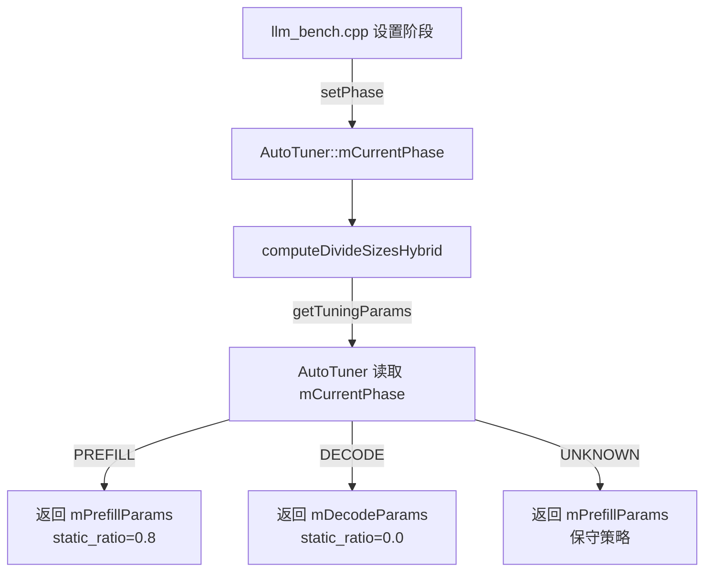

# 推理阶段管理使用指南

## 架构改进

将推理阶段状态（Prefill/Decode）存储在 `AutoTuner` 单例中，而不是作为函数参数传递。

## 核心优势

✅ **更内聚**：阶段状态和调度参数统一管理  
✅ **更简洁**：函数签名更清爽，不需要到处传递 `is_prefill` 参数  
✅ **线程安全**：使用 `std::atomic<InferencePhase>` 保证多线程安全  
✅ **易扩展**：未来可轻松添加新阶段（Warmup、Benchmark 等）

---

## API 使用方法

### 1. 设置推理阶段

```cpp
#include "backend/cpu/AutoTuner.hpp"

// 在 Prefill 阶段开始前设置
MNN::AutoTuner::getInstance()->setPhase(MNN::InferencePhase::PREFILL);

// 在 Decode 阶段开始前设置
MNN::AutoTuner::getInstance()->setPhase(MNN::InferencePhase::DECODE);
```

### 2. 查询当前阶段

```cpp
auto phase = MNN::AutoTuner::getInstance()->getPhase();
if (phase == MNN::InferencePhase::PREFILL) {
    // Prefill 阶段逻辑
}
```

### 3. 获取调度参数（自动根据当前阶段）

```cpp
// 旧 API（已废弃）：
// TuningParams params = tuner->getTuningParams(is_prefill);

// 新 API：自动根据 mCurrentPhase 返回
TuningParams params = tuner->getTuningParams();
```

---

## llm_bench.cpp 集成示例

```cpp
#include "backend/cpu/AutoTuner.hpp"

for (int i = 0; i < nRepeat; ++i) {
    // ============ Prefill 阶段 ============
    MNN::AutoTuner::getInstance()->setPhase(MNN::InferencePhase::PREFILL);
    MNN_PRINT("[MARKER] PREFILL START\n");
    
    int prefill_task_before = g_task_count.load();
    llm->response(tokens, nullptr, nullptr, 1);
    int prefill_task_after = g_task_count.load();
    
    print_task_stats("Prefill", prefill_task_before, prefill_task_after, ...);
    MNN_PRINT("[MARKER] PREFILL END\n");
    
    // ============ Decode 阶段 ============
    MNN::AutoTuner::getInstance()->setPhase(MNN::InferencePhase::DECODE);
    MNN_PRINT("[MARKER] DECODE START\n");
    
    int decode_task_before = g_task_count.load();
    llm->response(tokens1, nullptr, nullptr, decodeTokens);
    int decode_task_after = g_task_count.load();
    
    print_task_stats("Decode", decode_task_before, decode_task_after, ...);
    MNN_PRINT("[MARKER] DECODE END\n");
}
```

---

## 内部实现流程



---

## 调试输出示例

```bash
[AutoTuner] Initialized with default params:
  Prefill: static_ratio=0.80, step_size=4
  Decode:  static_ratio=0.00, step_size=1

[AutoTuner] Phase changed: UNKNOWN -> PREFILL

==================== [MARKER] PREFILL START ====================
[Analyz] === Prefill Phase Statistics ===
[Analyz] Total Ops: 1523
[Analyz] Small Ops (Hit Uniform): 45
[Analyz] Small Task Ratio: 2.95%
==================== [MARKER] PREFILL END ====================

[AutoTuner] Phase changed: PREFILL -> DECODE

==================== [MARKER] DECODE START ====================
[Analyz] === Decode Phase Statistics ===
[Analyz] Total Ops: 8734
[Analyz] Small Ops (Hit Uniform): 7821
[Analyz] Small Task Ratio: 89.55%
==================== [MARKER] DECODE END ====================
```

---

## 枚举定义

```cpp
enum class InferencePhase {
    PREFILL = 0,  // Prefill 阶段（首次处理 prompt）
    DECODE = 1,   // Decode 阶段（逐 token 生成）
    UNKNOWN = -1  // 未知阶段（默认使用 Prefill 参数）
};
```

---

## 注意事项

1. **必须在推理前设置阶段**：在调用 `llm->response()` 之前调用 `setPhase()`
2. **线程安全**：`setPhase()` 和 `getPhase()` 是线程安全的，可以在多线程环境中使用
3. **默认行为**：如果从未设置过阶段，默认为 `UNKNOWN`，会使用 Prefill 参数（保守策略）
4. **阶段切换日志**：每次阶段切换时会自动打印日志，便于调试

---

## Phase 2 预留接口

```cpp
// 反馈接口：未来用于自动调优
AutoTuner::getInstance()->feedback(cost_time);

// 急停开关：性能异常时切换到保守策略
AutoTuner::getInstance()->setPanicMode(true);
```

这些接口在 Phase 1 中是空实现，为未来的 Hill Climbing 自动调优预留。
